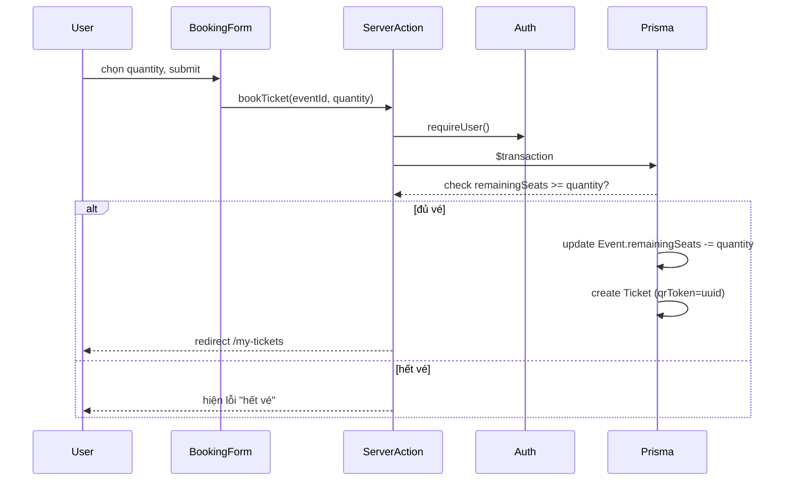

# Phase 3: Event Page & Ticket Booking + QR

## Context Links
- [plan.md](./plan.md)
- [phase-01-setup-data-model.md](./phase-01-setup-data-model.md)
- [phase-02-authentication.md](./phase-02-authentication.md)

## Overview
- Priority: P1 (core user flow)
- Status: Done
- Trang chủ hiện event `open` duy nhất, form đặt vé (số lượng, không chọn ghế), transaction chống oversell, trang "Vé của tôi" hiện QR code.

## Requirements
- Functional:
  - `/` query Event có `status = "open"`. Không có → hiện empty state "Hiện chưa mở bán vé".
  - Có event open → hiện poster, tên phim, mô tả, giờ chiếu, địa điểm, giá vé, số vé còn lại, input số lượng + nút "Đặt vé".
  - Bấm "Đặt vé" khi chưa đăng nhập → redirect Google sign-in, quay lại trang sau khi login.
  - Đặt vé: server action/API route chạy trong `prisma.$transaction` — đọc `remainingSeats`, nếu `>= quantity` thì trừ đi + tạo `Ticket` (qrToken tự sinh uuid), else throw lỗi "Không đủ vé".
  - `/my-tickets` — list ticket của user hiện tại (`where userId = session.user.id`), mỗi ticket render QR code từ `qrToken` + thông tin event liên quan + trạng thái (booked/checked_in).
- Non-functional: transaction phải atomic để 2 request đặt vé đồng thời không vượt `totalSeats`.

## Architecture
```
src/app/page.tsx                        # Trang chủ = event đang open
src/app/actions/booking.ts              # Server Action bookTicket(eventId, quantity)
src/app/my-tickets/page.tsx             # Danh sách vé của user
src/components/ticket-qr.tsx            # Component render QR (dùng lib `qrcode`)
src/components/booking-form.tsx         # Form chọn số lượng + submit
```

### Data flow đặt vé


## Related Code Files
**Create:**
- `src/app/page.tsx`
- `src/app/actions/booking.ts`
- `src/app/my-tickets/page.tsx`
- `src/components/ticket-qr.tsx`
- `src/components/booking-form.tsx`
- `src/components/sign-in-button.tsx` (nếu chưa có từ phase 2)

**Modify:**
- Không cần sửa schema (đã đủ từ phase 1).

## Implementation Steps
1. Viết query lấy event open: `prisma.event.findFirst({ where: { status: "open" } })` trong `page.tsx` (Server Component).
2. Empty state: nếu `null` → render thông báo tĩnh, không lỗi.
3. Component `BookingForm` (Client Component): input number (min 1, max = remainingSeats, disable nếu remainingSeats = 0), nút submit gọi Server Action.
4. Server Action `bookTicket`:
   ```ts
   "use server";
   export async function bookTicket(eventId: string, quantity: number) {
     const user = await requireUser(); // throw nếu chưa login -> catch ở caller, redirect signIn
     if (quantity < 1) throw new Error("INVALID_QUANTITY");
     await prisma.$transaction(async (tx) => {
       const event = await tx.event.findUniqueOrThrow({ where: { id: eventId } });
       if (event.status !== "open") throw new Error("EVENT_NOT_OPEN");
       if (event.remainingSeats < quantity) throw new Error("NOT_ENOUGH_SEATS");
       await tx.event.update({
         where: { id: eventId },
         data: { remainingSeats: { decrement: quantity } },
       });
       await tx.ticket.create({
         data: { eventId, userId: user.id, quantity },
       });
     });
     revalidatePath("/");
     revalidatePath("/my-tickets");
   }
   ```
   Lưu ý: dùng `decrement` (atomic ở mức DB) kết hợp check trong cùng transaction để tránh race condition — SQLite transaction là serializable theo write-lock mặc định của Prisma, đủ an toàn cho quy mô local/demo.

   **Cập nhật sau code review cuối (fix bug High):** bản implement thật thay đọc-rồi-ghi ở trên bằng **conditional atomic `updateMany`** — check `status = "open" AND remainingSeats >= quantity` ngay trong mệnh đề `where` của `tx.event.updateMany`, decrement cùng một câu lệnh DB (`count === 0` → phân biệt lỗi not-found/not-open/hết vé bằng 1 lần đọc lại). Cách này loại bỏ khoảng hở TOCTOU giữa đọc và ghi, an toàn kể cả nếu sau này đổi sang DB có connection pool thật (Postgres...), không chỉ dựa vào SQLite tự serialize. Xem `src/app/actions/booking.ts`.
5. Xử lý lỗi: nếu chưa login, action nên redirect tới Google sign-in kèm callbackUrl về lại trang hiện tại (dùng `signIn("google", { redirectTo: "/" })` từ `auth.ts` export, hoặc check session trước ở client và hiện nút "Đăng nhập để đặt vé" thay vì gọi action).
6. Trang `/my-tickets`: query `prisma.ticket.findMany({ where: { userId }, include: { event: true }, orderBy: { createdAt: "desc" } })`. Nếu chưa login → redirect `/api/auth/signin` hoặc hiện nút đăng nhập.
7. Component `TicketQr`: dùng `qrcode` lib generate data URL từ `qrToken`, hiển thị ``:
   ```ts
   import QRCode from "qrcode";
   const dataUrl = await QRCode.toDataURL(ticket.qrToken);
   ```
   (chạy server-side trong page, truyền `dataUrl` xuống component, hoặc dùng client-side canvas nếu cần re-render — server-side đơn giản hơn cho MVP).
8. Hiện trạng thái vé (booked/checked_in) bằng badge màu khác nhau.

## Todo List
- [x] Trang chủ query + hiện event open, empty state khi không có
- [x] `BookingForm` component (validate quantity client-side cơ bản)
- [x] Server Action `bookTicket` với transaction chống oversell (đã fix bug High ở vòng code review cuối: chuyển sang conditional atomic `updateMany` — xem ghi chú ở Implementation Steps)
- [x] Redirect/prompt đăng nhập nếu chưa login trước khi đặt vé (server-side: hiện nút "Đăng nhập để đặt vé" thay vì form nếu chưa có session; client-side fallback: nếu action trả `UNAUTHORIZED` thì redirect `/sign-in`)
- [x] Trang `/my-tickets` list vé + QR
- [x] `TicketQr` component generate QR từ `qrToken`
- [x] Test race condition khi `remainingSeats` thấp (nhiều request đặt vé gần như đồng thời) → chỉ đủ số vé thành công, không oversell — **đã pass qua stress-test tự động** (gọi trực tiếp transaction/server action đồng thời, bypass đăng nhập UI). Kịch bản 2 tab trình duyệt thật với 2 tài khoản Google khác nhau **vẫn chưa chạy được** — thiếu `AUTH_GOOGLE_ID`/`AUTH_GOOGLE_SECRET` thật, xem Phase 5

## Success Criteria
- Đặt vé thành công khi đủ chỗ, `remainingSeats` giảm đúng số lượng.
- Đặt vé khi `remainingSeats < quantity` → báo lỗi rõ ràng, không tạo ticket, không trừ sai.
- QR code hiện đúng, mỗi vé QR khác nhau (khác `qrToken`).
- Test race condition (nhiều request gần đồng thời, seats thấp) không bị âm/oversell — **đã pass qua stress-test tự động**; kịch bản 2 tab trình duyệt thật với 2 Google account khác nhau vẫn chờ OAuth credentials thật (Phase 5).

## Risk Assessment
- **Rủi ro:** SQLite mặc định Prisma dùng "busy timeout" retry khi có write đồng thời — có thể chậm nếu nhiều request cùng lúc (không phải vấn đề ở quy mô demo/local 1 admin).
- **Rủi ro:** User đặt vé khi event chuyển từ `open` sang `closed` giữa lúc submit → check `event.status !== "open"` trong transaction đã cover.

## Security Considerations
- `bookTicket` luôn verify `requireUser()` server-side trước khi ghi DB — không tin request body chứa `userId`.
- `qrToken` là UUID random (128-bit) — đủ khó đoán cho MVP, không cần ký HMAC thêm.

## Next Steps
- Phase 4 dùng data Ticket này để admin xem danh sách + đánh dấu check-in (update `status` sang `checked_in`).
